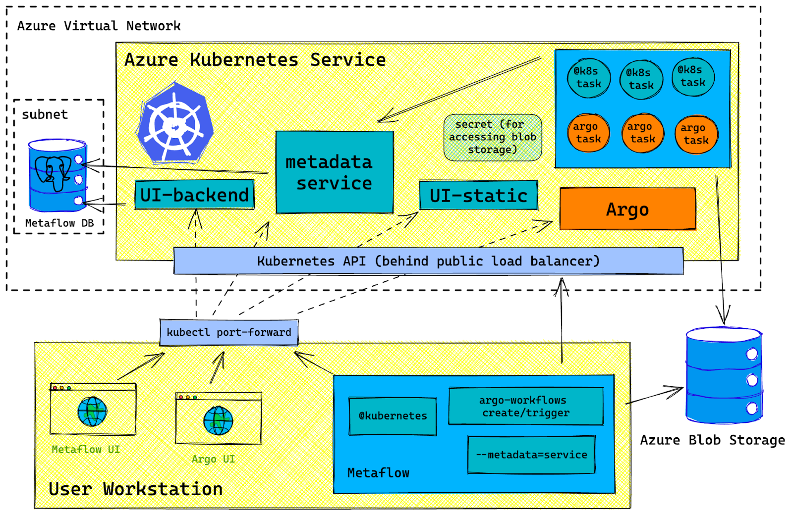

# Develop, deploy and operate data science & machine learning workflows with Metaflow on Azure Kubernetes Service (AKS)

This article shows you how to use Metaflow on Azure Kubernetes Service (AKS). Metaflow is an open-source library that makes it easy to develop, deploy and operate data-intensive applications, commonly in the data science, ML, and AI space. When using Metaflow with Kubernetes as a compute backend (among others), you can focus on delivering business value while iterating from prototype to production, without focusing on infrastructure and deployment intricacies. Keep in mind that Metaflow isn't officially supported by Microsoft, so use it at your own discretion.

For more information, see [Introduction to Metaflow][metaflow].

[!INCLUDE [open source disclaimer](./includes/open-source-disclaimer.md)]

## Metaflow Case Studies

Metaflow is ideal for modern businesses which are eager to utilize data science and ML, eliminating the need to rely on a medley of point solutions and custom systems. The foundation of a robust & well-defined architecture, provided by Metaflow, helps data scientists and ML engineers alike in iterating quickly as well as deploying confidently. While originally created at Netflix, Metaflow is used and trusted by a plethora of companies spanning a wide variety of domains such as:

- Healthcare, Biotech and Medical Devices
- Financial Services and Fintech
- Logistics and Supply Chain
- Software and Technology
- E-commerce and Online Marketplace
- Energy and Sustainable Technology
- Entertainment and Digital Media
- Manufacturing and Engineering

For more information, see [Metaflow Case Studies](https://outerbounds.com/stories).

## Prerequisites

* An Azure subscription. If you don't have an Azure subscription, you can create a [free account][azure-free].
  * If you have multiple subscriptions, make sure you select the correct one using the `az account set --subscription <subscription-id>` command.
* The Azure CLI installed and configured. Check your version using the `az --version` command. If you need to install or upgrade, see [Install the Azure CLI][install-azure-cli].
* The Terraform CLI installed and updated. Check your version using the `terraform version` command. If you need to install or upgrade, see [Install Terraform][install-terraform].
* The `kubectl` CLI installed and updated. Install it locally using the `az aks install-cli` command or using [Install kubectl][install-kubectl].

> [!NOTE]
> If you're using the Azure Cloud Shell, the Azure CLI, and kubectl are already installed.

### Provision Azure Resources

1. Download [Metaflow on Azure terraform templates](https://github.com/outerbounds/metaflow-tools/tree/master/azure/terraform)

    ```bash
    git clone git@github.com:outerbounds/metaflow-tools.git
    ```

2. Login to Azure and Initialize your Terraform Workspace

    ```bash
    az login
    ```

and 

    ```bash
    terraform init
    ```

3. Set `org_prefix`

Some Azure resources must have globally unique names:

- Azure storage account
- Azure PostgreSQL Flexible Server

`org_prefix` will be used to ensure this uniqueness.

Uncomment [this line](https://github.com/outerbounds/metaflow-tools/blob/f7ff07d49563dc8217f7fe49150b2d50a14d999f/azure/terraform/variables.tf#L9), and set `org_prefix` to a value of your choice. Short and distinctive is best.

4. Apply Terraform template to provision Azure Infrastructure

From the locally cloned `metaflow-tools/azure/terraform` directory, run:

    ```bash
    terraform apply -target="module.infra"
    ```

A plan of action will be printed to the terminal. You should review it before accepting.

## Deploy Metaflow services to AKS Cluster

From the locally cloned `metaflow-tools/azure/terraform` directory, run:

    ```bash
    terraform apply -target="module.services"
    ```



### End setup instructions

When the command above completes, it will print a set of setup instructions for Metaflow end users (folks who will be writing and running flows). These instructions are meant to get end users started on running flows quickly.

You can access the Terraform instruction output at any time by running:

    ```bash
    terraform output -raw END_USER_SETUP_INSTRUCTIONS
    ```

#### Sample Output

```
Setup instructions for END USERS (e.g. someone running Flows vs the new stack):
-------------------------------------------------------------------------------
There are three steps:
1. Ensuring Azure access
2. Configure Metaflow
3. Run port forwards
4. Install necessary Azure Python SDK libraries


STEP 1: Ensure you have sufficient access to these Azure resources on your local workstation:

- AKS cluster ("aks-ob-metaflow-minion") ("Azure Kubernetes Service Contributor" + "Azure Kubernetes Service Cluster User Role")
- Azure Storage ("metaflow-storage-container" in the storage account "stobmetaflowminion") ("Storage Blob Data Contributor")

You can use "az login" as a sufficiently capabable account. To see the credentials for the service principal
(created by terraform) that is capable, run this:

$ terraform output -raw SERVICE_PRINCIPAL_CREDENTIALS

Use the credentials with "az login"

$ az login --service-principal -u $AZURE_CLIENT_ID -p $AZURE_CLIENT_SECRET --tenant $AZURE_TENANT_ID

Configure your local Kubernetes context to point to the the right Kubernetes cluster:

$ az aks get-credentials --resource-group rg-metaflow-minion-westus --name aks-ob-metaflow-minion

STEP 2: Configure Metaflow:

$ metaflow configure azure
$ metaflow configure kubernetes

Use these values when prompted:

METAFLOW_DATASTORE_SYSROOT_AZURE=metaflow-storage-container/tf-full-stack-sysroot
METAFLOW_AZURE_STORAGE_BLOB_SERVICE_ENDPOINT=https://stobmetaflowminion.blob.core.windows.net/
METAFLOW_KUBERNETES_SECRETS=metaflow-azure-storage-credentials
METAFLOW_SERVICE_URL=http://127.0.0.1:8080/
METAFLOW_SERVICE_INTERNAL_URL=http://metadata-service.default:8080/
[For Argo only] METAFLOW_KUBERNETES_NAMESPACE=argo

Note: you can skip METAFLOW_SERVICE_AUTH_KEY (leave it blank)

STEP 3: Setup port-forwards to services running on Kubernetes:

option 1 - run kubectl's manually:
$ kubectl port-forward deployment/metadata-service 8080:8080
$ kubectl port-forward deployment/metaflow-ui-backend-service 8083:8083
$ kubectl port-forward deployment/metaflow-ui-static-service 3000:3000
$ kubectl port-forward -n argo deployment/argo-server 2746:2746

option 2 - this script manages the same port-forwards for you (and prevents timeouts)

$ python metaflow-tools/scripts/forward_metaflow_ports.py [--include-argo]

STEP 4: Install Azure Python SDK
$ pip install azure-storage-blob azure-identity
```

## Next steps

In this article, you learned how to install Metaflow on AKS using Terraform templates.
For more information, refer to the [detailed guide](https://docs.outerbounds.com/engineering/deployment/azure-k8s/deployment/).

To start building and deploying data and machine learning workflows, checkout the tutorials [here](https://docs.metaflow.org/getting-started/tutorials).

<!-- LINKS -->
[metaflow]: https://docs.metaflow.org/introduction/what-is-metaflow
[azure-free]: https://azure.microsoft.com/free
[install-azure-cli]: /cli/azure/install-azure-cli
[install-terraform]: https://learn.hashicorp.com/tutorials/terraform/install-cli
[install-kubectl]: https://kubernetes.io/docs/tasks/tools/install-kubectl/
